# Crazy Test 平台

## 简介

Crazy Test 是一个开源的测试平台，可以快速搭建测试平台支持接口用例、场景用例执行并生成测试报告。

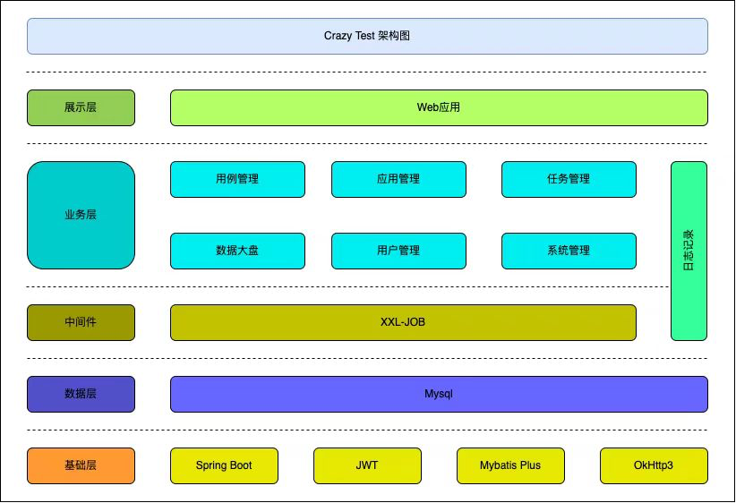

## 代码地址

* [前端,点击查看](https://github.com/crazy0261/crazy-test-ui.git)
* [后端，点击查看](https://github.com/crazy0261/crazy-test.git)

## 环境

- 前端：React + Antd + Antd Pro + AntV
- 后端：Spring Boot + MyBatis

## 部署

- Mysql 数据库
- XXl-Job 分布式任务调度框架

## 步骤

1. 下载源码

2. 打包

3. 安装docker

4. Dockerfile (其他方式也可实现)

- 构建 docker build -t crazy:1.0 .

5. 启动及运行容器

- docker run -d --name crazy-test -p 8080:8080 crazy-test:latest

## 页面

1. 登录
   
2. 接口用例
   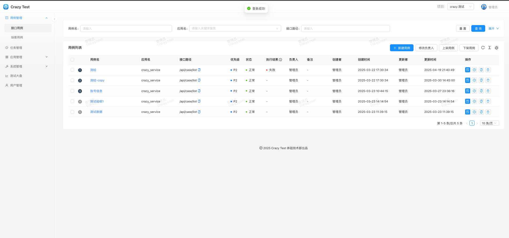
3. 接口用例执行
   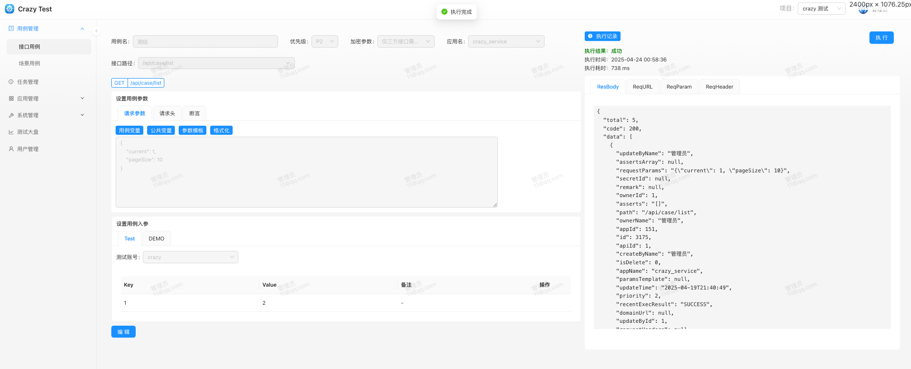
4. 场景用例
   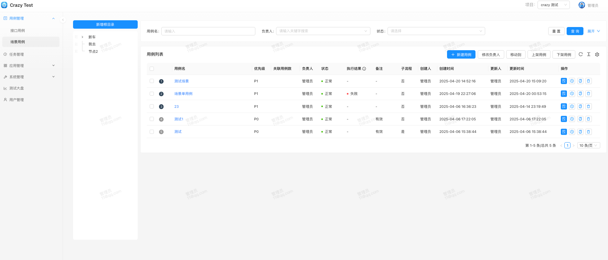
5. 场景用例执行
   
6. 定时任务
   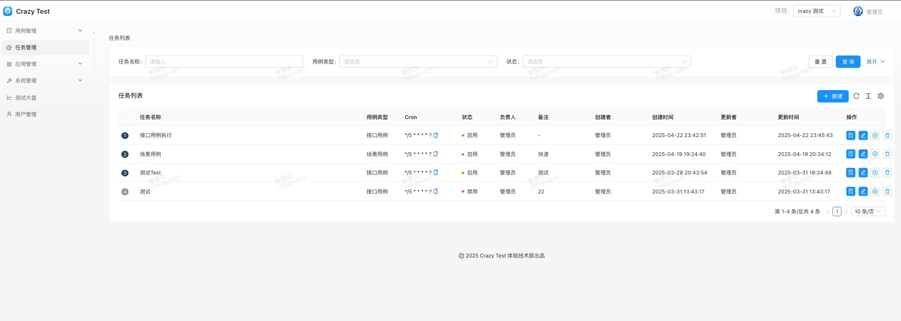
7. 定时任务详情
   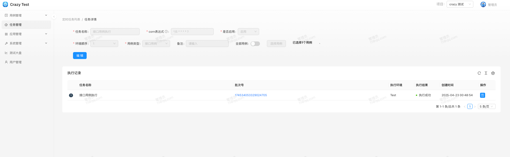
   8.应用管理
   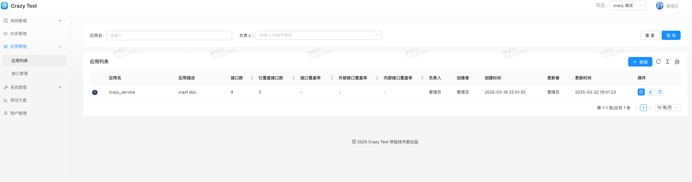
9. 接口管理
   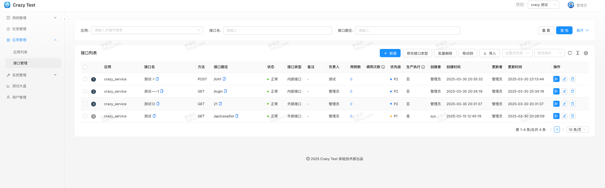
10. 系统管理-数据源管理
    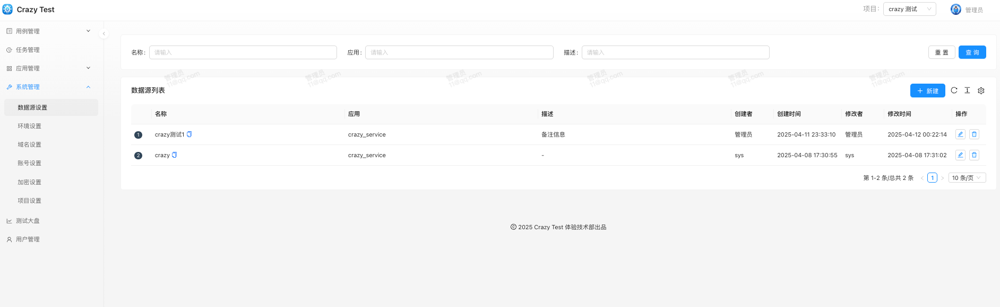
11. 系统管理-环境设置
    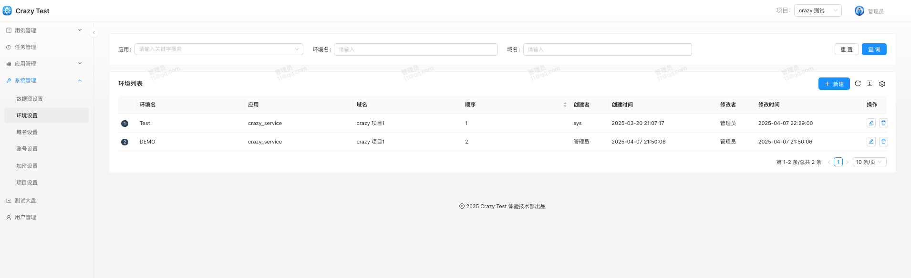
12. 系统管理-域名设置
    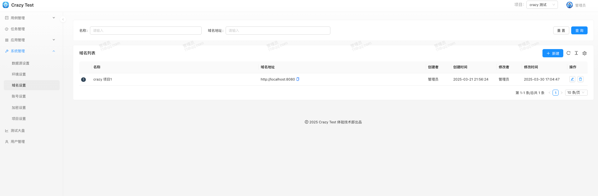
13. 系统管理-账号设置
    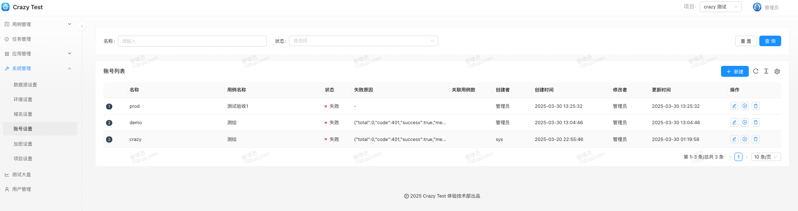
14. 系统管理-加密设置
    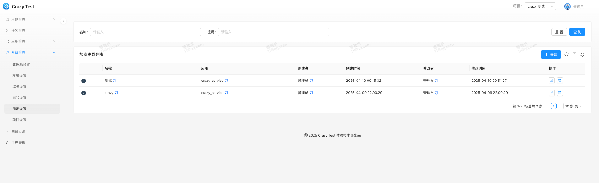
15. 系统管理-项目设置
    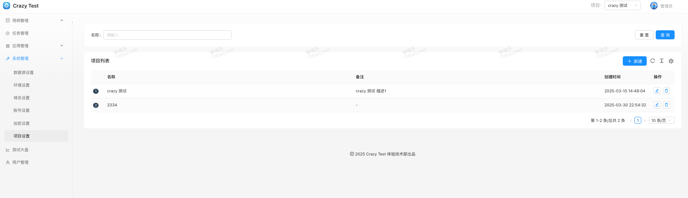
    16.用户管理
    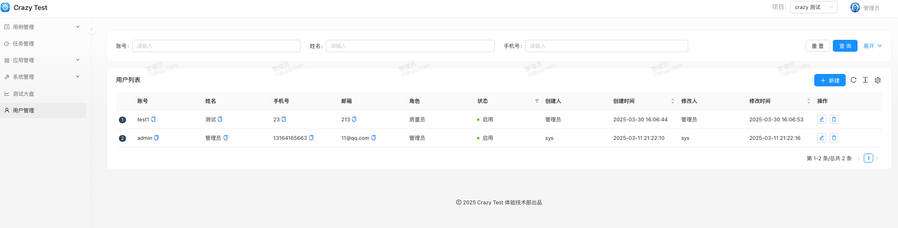
17. 数据大盘
    
    
    
